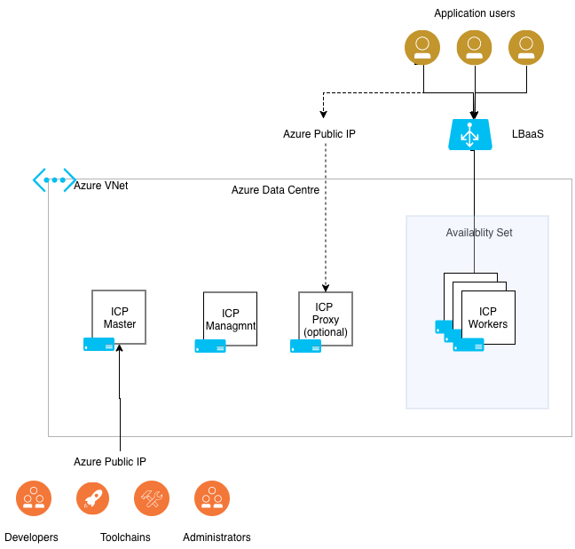

# Deploying IBM Cloud Private Community Edition on Azure using Terraform

This template provides a basic deployment of a single master, single proxy, single management node and three worker nodes azure VMs. Both Maser and Proxy are assigned public IP addresses so they can be easily accessed over the internet.

IBM Cloud Private Community Edition is installed directly from Docker Hub, so this template does not require access to ICP Enterprise Edition licenses and Image tarball.

This template is suitable for initial tests, and validations.


Note: This template uses the included temporary disk for the VM as the backing disk for Docker. This performant SSD disk, but certain azure maintenance events may delete the content of this disk, affecting the stability of your cluster.

## Infrastructure Architecture
The following diagram outlines the infrastructure architecture.


## Resources created by this template
|Resource type            | Resources      |
|----------------|-----------------------------|
| azurerm_resource_group | 1 new resource group for ICP cluster |
| azurerm_virtual_network | 1 new virtual network for ICP cluster |
| azurerm_route_table | 1 new route table |
| azurerm_subnet | <ul><li>1 subnet for cluster VMs<li>1 subnet for container network</ul> |
| azurerm_public_ip | <ul><li>bootnode pip (if enabled)<li>master pip<li>proxy pip</ul> |
| azurerm_network_interface | <ul><li>boot nic (if enabled)<li>master nic<li>proxy nic<li>management nic<li>worker nic</ul> |
| azurerm_network_security_group | <ul><li>boot_sg<li>master_sg<li>proxy_sg<li>worker_sg</ul> |
| azurerm_virtual_machine | <ul><li>boot (if enabled)<li>master<li>proxy<li>management<li>worker</ul> |
| azurerm_availability_set | <ul><li>workers</ul> |


## Using the Terraform template

1. git clone the repository

2. Create a [terraform.tfvars](https://www.terraform.io/intro/getting-started/variables.html#from-a-file) file to reflect your environment. Please see [variables.tf](variables.tf) and below tables for variable names and descriptions.

| variable           | default       |required| description                            |
|--------------------|---------------|--------|----------------------------------------|
| **Azure account options** | | |
|resource_group      |icp_rg         |No      |Azure resource group name               |
|location            |West Europe    |No      |Region to deploy to                     |
|storage_account_tier|Standard       |No      |Defines the Tier of storage account to be created. Valid options are Standard and Premium.|
|storage_replication_type|LRS            |No      |Defines the Replication Type to use for this storage account. Valid options include LRS, GRS etc.|
|default_tags        |{u'Owner': u'icpuser', u'Environment': u'icp-test'}|No      |Map of default tags to be assign to any resource that supports it|
| **ICP Virtual machine settings** | | |
|boot |{'vm_size':'Standard_A4_v2'<br>'nodes':0<br>'name':'boot'}|No | Boot node instance configuration |
|master |{'vm_size':'Standard_A4_v2'<br>'nodes':1<br>'name':'master'}|No | Master node instance configuration |
|management|{'vm_size':'Standard_A4_v2'<br>'nodes':1<br>'name':'mgmt'}|No | Management node instance configuration|
|proxy|{'vm_size':'Standard_A4_v2'<br>'nodes':1<br>'name':'proxy'}|No| Proxy node instance configuration |
|worker |{'vm_size':'Standard_A4_v2'<br>'nodes':3<br>'name':'worker'}|No| Worker node instance configuration |
|os_image            |ubuntu         |No      |Select from Ubuntu (ubuntu) or RHEL (rhel) for the Operating System. Details on RHEL [here](../../docs/rhel.md)|
|admin_username      |vmadmin        |No      |linux vm administrator user name        |
| **Azure network settings**| | |
|virtual_network_name|icp_vnet        | No      |The name for the virtual network. Leave blank and populate *_subnet_id to use existing Azure Virtual Network. See [azure-networking.md](../../docs/azure-networking.md) for details. |
|virtual_network_cidr | 10.0.0.0/16 | No | cidr for the Azure virtual network if creating new |
| subnet_name | icp_subnet | No | Name of the Subnet where VMs are placed. See [azure-networking.md](../../docs/azure-networking.md) for details. |
| subnet_prefix | 10.0.0.0/24 | No | The address prefix to use for the VM subnet. |
| controlplane_subnet_name |  | No | The name of the controlplane subnet. Leave blank single subnet for cluster |
| controlplane_subnet_prefix |  | No | The address prefix to use if creating separate controlplane subnet. |
| vm_subnet_id | | No | ID of vm subnet if using existing VNET. Only when var.virtual_network_name is empty. See [azure-networking.md](../../docs/azure-networking.md) for details.  |
| controlplane_subnet_id |  | No | ID of controlplane subnet if using existing VNET. Only when var.virtual_network_name is empty and want control plane separate from workers |
| container_subnet_id |  | No | ID of container subnet if using existing VNET. Only when var.virtual_network_name is empty |
|route_table_name    |icp_route      |No      |The name for the route table.           |
| **ICP Settings** | | | |
|cluster_name        |myicp          |No      |Deployment name for resources prefix. Will form part of DNS names, so must only contain alphanumeric characters and -    |
|ssh_public_key      |               |No      |SSH Public Key to add to authorized_key for admin_username. Required if you disable password authentication |
|disable_password_authentication|true           |No      |Whether to enable or disable ssh password authentication for the created Azure VMs. Default: true|
|icp_version         |3.1.2          |No      |ICP Version                             |
|cluster_ip_range    |10.0.0.1/24    |No      |ICP Service Cluster IP Range            |
|network_cidr        |10.1.0.0/16    |No      |ICP Network CIDR                        |
|instance_name       |icp            |No      |Name of the deployment. Will be added to virtual machine names|
|icpadmin_password   |admin          |No      |ICP admin password                      |


## Azure Network Options and information
You can read more about the Azure network and options in [docs/azure-networking.md](../../docs/azure-networking.md)


Here are some example terraform.tfvars files:

Simple terraform.tfvars to allow connectivity with existing ssh keypair.
```
ssh_public_key = "ssh-rsa AAAAB3NzaC1yc2EAAAABIwAAAQEAmGOJtZF5FYrpmEBI9GBcbcr4577pZ90lLxZ7tpvfbPmgXQVGoolChAY165frlotd+o7WORtjPiUlRnr/+676xeYCZngLh46EJislXXvcmZrIn3eeQTRdOlIkiP3V4+LiR9WvpyvmMY9jJ05sTGgk39h9LKhBs+XgU7eZMXGYNU7jDiCZssslTvV1i7SensNqy5bziQbhFKsC7TFRld9leYPgCPtoiSeFIWoXSFbQQ0Lh1ayPpOPb0C2k4tYgDFNr927cObtShUOY1dGGBZygUVKQRro1LZzq39DhmvmMCawCnnQt6A8jz4PE69jP62gnlBsdXQDvEm/L/LBrO4CBbQ=="
```

terraform.tfvars enabling SSH password authentication and provisioning 4 worker nodes
```
disable_password_authentication = false
worker = {
  "nodes" = 4
}
```

#### Red Hat support
Details on RHEL support [here](../../docs/rhel.md)

### Using the environment

Follow the instructions outlined [here](../../README.md)

#### Using the Azure Loadbalancer
See details and examples for exposing your workloads with Azure LoadBalancer in [azure-loadbalancer.md](../../docs/azure-loadbalancer.md)
