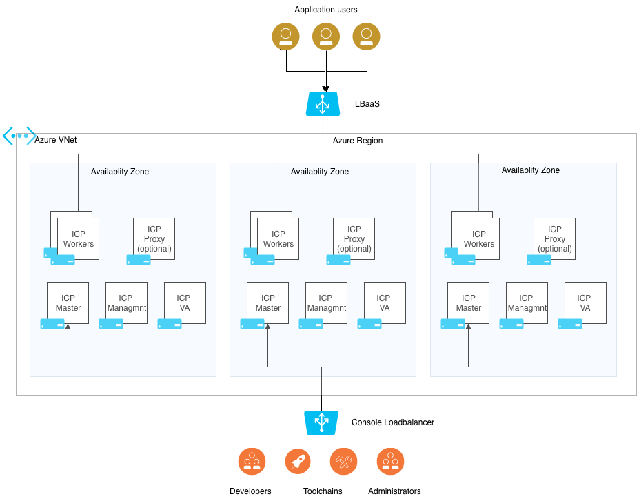

# Deploying IBM Cloud Private Enterprise Edition on Azure using Terraform

This template deploys ICP Enterprise Edition across three Azure Availability Zones.


Limitations
- Since Azure Cloud Provider for Kubernetes 1.11 is not Zone aware, so you should not use Dynamic Volume Provisioning with a multi-zone setup.

## Infrastructure Architecture
The following diagram outlines the infrastructure architecture.


## Resources created by this template
|Resource type            | Resources      |
|----------------|-----------------------------|
| azurerm_resource_group | 1 new resource group for ICP cluster |
| azurerm_virtual_network | 1 new virtual network for ICP cluster |
| azurerm_route_table | 1 new route table |
| azurerm_subnet | <ul><li>1 subnet for cluster VMs<li>1 subnet for container network</ul> |
| azurerm_public_ip | <ul><li>bootnode pip<li>master pip</ul> |
| azurerm_network_interface | <ul><li>boot nic<li>master nic<li>proxy nic<li>management nic<li>worker nic</ul> |
| azurerm_network_security_group | <ul><li>boot_sg<li>master_sg<li>proxy_sg<li>worker_sg</ul> |
| azurerm_lb | <ul><li>Single Standard SKU LoadBalancer</ul>
| azurerm_lb_rule | <ul><li>master_rule<li>proxy_rule</ul> |
| azurerm_lb_backend_address_pool | <ul><li>masterlb_pool<li>proxylb_pool</ul>
| azurerm_network_interface_backend_address_pool_association | <ul><li>masterlb<li>proxylb</ul> |
| azurerm_virtual_machine | <ul><li>boot<li>master<li>proxy<li>management<li>worker</ul> |


## Using the Terraform templates

1. git clone the repository

2. Create a [terraform.tfvars](https://www.terraform.io/intro/getting-started/variables.html#from-a-file) file to reflect your environment. Please see [variables.tf](variables.tf) and below tables for variable names and descriptions.

| variable           | default       |required| description                            |
|--------------------|---------------|--------|----------------------------------------|
| **Azure account options** | | |
|resource_group      |icp_rg         |No      |Azure resource group name               |
|location            |West Europe    |No      |Region to deploy to                     |
|storage_account_tier|Standard       |No      |Defines the Tier of storage account to be created. Valid options are Standard and Premium.|
|storage_replication_type|LRS            |No      |Defines the Replication Type to use for this storage account. Valid options include LRS, GRS etc.|
|default_tags        |{u'Owner': u'icpuser', u'Environment': u'icp-test'}|No      |Map of default tags to be assign to any resource that supports it|
| **ICP Virtual machine settings** | | |
|master |{'vm_size':'Standard_A8_v2'<br>'nodes':3<br>'name':'master'}|No | Master node instance configuration |
|management|{'vm_size':'Standard_A8_v2'<br>'nodes':3<br>'name':'mgmt'}|No | Management node instance configuration|
|proxy|{'vm_size':'Standard_A2_v2'<br>'nodes':3<br>'name':'proxy'}|No| Proxy node instance configuration |
|worker |{'vm_size':'Standard_A4_v2'<br>'nodes':6<br>'name':'worker'}|No| Worker node instance configuration |
|os_image            |ubuntu         |No      |Select from Ubuntu (ubuntu) or RHEL (rhel) for the Operating System|
|admin_username      |vmadmin        |No      |linux vm administrator user name        |
| **Azure network settings**| | |
|virtual_network_name|icp_vnet           |No      |The name for the virtual network.       |
|route_table_name    |icp_route      |No      |The name for the route table.           |
| **ICP Settings** | | | |
|cluster_name        |myicp          |No      |Deployment name for resources prefix    |
|ssh_public_key      |               |No      |SSH Public Key to add to authorized_key for admin_username. Required if you disable password authentication |
|disable_password_authentication|true           |No      |Whether to enable or disable ssh password authentication for the created Azure VMs. Default: true|
|icp_version         |3.1.2         |No      |ICP Version                             |
|cluster_ip_range    |10.1.0.0/24    |No      |ICP Service Cluster IP Range            |
|network_cidr        |10.0.128.0/17    |No      |ICP Network CIDR                        |
|instance_name       |icp            |No      |Name of the deployment. Will be added to virtual machine names|
|icpadmin_password   |admin          |No      |ICP admin password                      |


### Notes on Azure Cloud Provider for Kubernetes

#### Availability Zones
Kubernetes adds support for Azure Availability Zones in version 1.12, as an alpha feature.
Read more about it [here](https://github.com/kubernetes/cloud-provider-azure/blob/master/docs/using-availability-zones.md)

Here is an example terraform.tfvars file:

Simple terraform.tfvars to allow connectivity with existing ssh keypair.
```
ssh_public_key = "ssh-rsa AAAAB3NzaC1yc2EAAAABIwAAAQEAmGOJtZF5FYrpmEBI9GBcbcr4577pZ90lLxZ7tpvfbPmgXQVGoolChAY165frlotd+o7WORtjPiUlRnr/+676xeYCZngLh46EJislXXvcmZrIn3eeQTRdOlIkiP3V4+LiR9WvpyvmMY9jJ05sTGgk39h9LKhBs+XgU7eZMXGYNU7jDiCZssslTvV1i7SensNqy5bziQbhFKsC7TFRld9leYPgCPtoiSeFIWoXSFbQQ0Lh1ayPpOPb0C2k4tYgDFNr927cObtShUOY1dGGBZygUVKQRro1LZzq39DhmvmMCawCnnQt6A8jz4PE69jP62gnlBsdXQDvEm/L/LBrO4CBbQ=="
```

terraform.tfvars enabling SSH password authentication and provisioning 4 worker nodes
```
disable_password_authentication = false
worker = {
  "nodes" = 4
}
```

#### Using the environment

#### Logging in
When the Terraform deployment is complete, you will see an output similar to this:

```
ICP Admin Password = e66bd82cfeb5ad404ff7f62ba0ac83df
ICP Admin Username = admin
ICP Boot node = 40.67.221.37
ICP Console URL = https://icpdemo-feb5ad40.westeurope.cloudapp.azure.com:8443
ICP Kubernetes API URL = https://icpdemo-feb5ad40.westeurope.cloudapp.azure.com:8001
```

Open the Console URL in a web browser and log in with the Admin Username and Admin Password provided from the Terraform template output.


#### Using the Azure Loadbalancer

A simple test can be to create a deployment with two nginx pods that are exposed via external load balancer. To do this using kubectl follow the instructions on [IBM KnowledgeCenter Kubectl CLI](https://www.ibm.com/support/knowledgecenter/SSBS6K_3.1.0/manage_cluster/cfc_cli.html) to set up the command line client.

By default this deployment has image security enforcement enabled. You can read about Image security on [IBM KnowledgeCenter Image Security](https://www.ibm.com/support/knowledgecenter/SSBS6K_3.1.0/manage_images/image_security.html) Ensure the appropriate policies are in place.

To allow pulling nginx from Docker Hub container registry, create a file with this content:
  ```
  apiVersion: securityenforcement.admission.cloud.ibm.com/v1beta1
  kind: ImagePolicy
  metadata:
    name: allow-nginx-dockerhub
  spec:
   repositories:
   # nginx from Docker hub Container Registry
    - name: "docker.io/nginx/*"
      policy:
  ```

Then apply this policy in the namespace you're working in

  ```
  $ kubectl apply -f
  ```

Now you can deploy two replicas of an nginx pod

  ```
  kubectl run mynginx --image=nginx --replicas=2 --port=80
  ```

Finally expose this deployment

  ```
  kubectl expose deployment mynginx --port=80 --type=LoadBalancer
  ```

After a few minutes the load balancer will be available and you can see the IP address of the loadbalancer

  ```
  $ kubectl get services
  NAME         TYPE           CLUSTER-IP   EXTERNAL-IP      PORT(S)        AGE
  kubernetes   ClusterIP      10.1.0.1     <none>           443/TCP        12h
  mynginx      LoadBalancer   10.1.0.220   51.145.183.111   80:30432/TCP   2m
  ```
